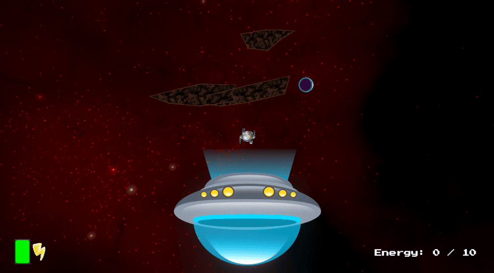
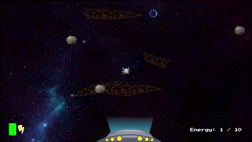
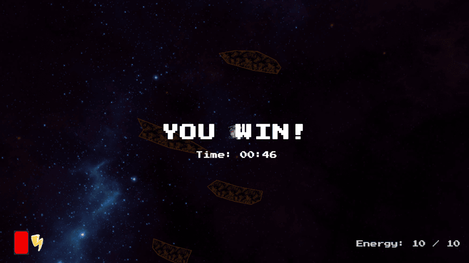
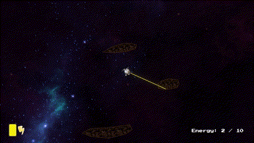

 # 🚀 GravityRouge
A 2D space game developed in Unity, in which you move among asteroids in a weightless state, using a jetpack and a rope to survive. Your goal is to collect 10 energy cores between procedurally placed asteroids.

---

## 🎮 Gameplay Features

- ✴️ **Jetpack with fuel system**  
  The player can push in the direction of W, A, S, D using a jetpack. Each push consumes fuel which regenerates over time.
- 🪢 **Grappling hook mechanic**  
  Right-click to shoot a rope toward a nearby asteroid. Use the mouse scroll to shorten or lengthen the rope. It breaks if overstretched!
- 🌌 **Asteroid gravity**
  Each asteroid platform exerts its own gravity field. The player is constantly pulled toward the closest one.
  

  

- 💥 **Deadly moving asteroids**  
  Asteroids fly in from the left and right edges of the screen. Getting hit results in a Game Over.

  

  
- 🎯 **Goal: Collect 10 energy cores**  
  Energy cores spawn in new positions each game – without overlapping with asteroids – and appear every 10 platforms.
- ⏱️ **Win timer**  
  After collecting the final energy core, a “YOU WIN!” panel appears along with your completion time.
  

---

## 🌀 Procedural Generation

- 🔁 **Each run is different**
  - Asteroid platforms are generated procedurally with random positions, spacing, and slight angles.

---
  
## 🎨 Visual & Effects

- 🌠 **Random space background**  
  Each playthrough features a randomly chosen animated space backdrop.
- 🌈 **Jetpack visual feedback**  
  Subtle visual flames appear in the direction of movement when using the jetpack.
- 🟥 **Grappling rope tension**  
The rope changes color as it tightens. If it turns red – it snaps!

  

---

## 🕹️ Controls

| Key        | Action                                  |
|------------|------------------------------------------|
| `WASD`     | Set direction for jetpack push          |
| `Space`    | Push in the selected direction           |
| `Right Click` | Shoot grappling hook                |
| `Scroll`   | Adjust rope length                       |
| `G`        | (Optional) Invert gravity                |

---

## 🎨 Assets & Credits

- 🔋 [Energy Icon](https://opengameart.org/content/energy-icon) by **AntumDeluge** — License: [CC-BY 3.0](https://creativecommons.org/licenses/by/3.0/)
- 🚀 [Spaceship 2D](https://opengameart.org/content/spaceship-2d) by **Kenney** — License: [CC0](https://creativecommons.org/publicdomain/zero/1.0/)
- 🛡️ [Shield Effect](https://opengameart.org/content/shield-effect) by **C0D3M4513R** — License: [CC0](https://creativecommons.org/publicdomain/zero/1.0/)
- 👨‍🚀 [Cosmonaut (Top-down view)](https://opengameart.org/content/cosmonaut-top-down-view) by **AntumDeluge** — License: [CC-BY 3.0](https://creativecommons.org/licenses/by/3.0/)
- 🌌 [Ulukai’s Space Skyboxes](https://opengameart.org/content/ulukais-space-skyboxes) by **Ulukai** — License: [CC-BY 3.0](https://creativecommons.org/licenses/by/3.0/)
- 🌋 [Volcano Lava Floor](https://opengameart.org/content/volcano-lava-floor) by **surt** — License: [CC-BY 3.0](https://creativecommons.org/licenses/by/3.0/)
- 🪨 [Asteroids](https://opengameart.org/content/asteroids-0)
by **p0ss** — License: [CC-BY 3.0](https://creativecommons.org/licenses/by/3.0/)

---

## 🛠️ Requirements

- Unity 2022.3 LTS or newer
- TextMeshPro (included with Unity by default)

---

## 📌 Author

This project was created as a Unity 2D gameplay showcase.  
It features fully custom physics, procedural generation, grappling mechanics, jetpack fuel logic, and UI systems – built entirely from scratch.

